# Prediction-of-Early-Readmission-of-Inpatients-Analysis-of-69-970-Clinical-Patient-Records

## Abimbola Ogungbire – University of North Carolina at Greensboro

### Introduction

Having handled the 101,766 records of data collected from Health Facts database, we are left with 69,970 records of data to build a classification model for early readmission of patients with diabetes. In previous assignments, we have made effort to reiterate the model in [1]. This report will attempt to evaluate the model in [1], build a logistic regression using a different approach from the one used in [1] and also consider a different algorithm. In this case, I will employ the use of random forest and compare these two algorithms.

### Methodology

### VALIDATION OF LOGISTIC MODEL IN [1]

In order to ascertain how well the logistic regression of the author predicts, our data of 69,970 observations have been split into 70% train data set and 30% test data set. Having built the model, one question still remain unanswered – is the model good enough? 
The final model as in the paper was trained using the training data set. It was used to predict the test data set and the model accuracy was assessed. The ROC curve and AUC value of the both models with and without interaction was checked. The result of the model validation is as presented in the result and discussion section below.
A confusion matrix containing the classification error rate of both classes was also checked. The model accuracy was compared with the out of bag error rate and the discrepancy was noted.
LOGISTIC REGRESSION MODEL USING BEST GLM SELECTION TECHNIQUE
Having done the preliminary analysis of the data as recommended by [1] in previous assignments, I have decided to build a logistic regression using best glm selection approach. 
In order to address the primary question which involves the association between A1C result and early readmission of patients, I have built a selected a model while controlling for HbA1c.
The model was developed in stages and each stage was succeeded by an analysis of deviance test. The final model was finally compared with the initial model using an analysis of variance test to check if the two models differ from one another.
First, we employed the use of best glm selection technique to select an optimum model using the Akaike Information Criterion (AIC). Second, we added HbA1c to the selected model. Third, we added possible pairwise interactions to the model in the second step one after the other to take note of only the significant ones. Finally, we added the pairwise interactions of HbA1c and each covariates to the model in the third stage and selected only the significant HbA1c interaction(s).
The above stages of model selection were carried out on the train data. The validation of the model was done using the test data set. The model accuracy, sensitivity, specificity and auc were used to assess how well the model predicts.

### RANDOM FOREST

A random forest model unlike the logistic model is more robust and might do a better job in classifying the target variable. However, measures have been put in place to make sure the model does not over fit and does not give misleading result.
The random forest was built in three stages. The first model was built to include all variables except HbA1c. Second, I checked the variable importance plot to take out few variables that are less important in our model. Finally, I added HbA1c to the model obtained in the second stage.
Similar to the logistic regression, the above steps were carried out using the train data set. The test data set was used in model evaluation and similar criteria used in the previous algorithm.

### Result and Discussion

VALIDATION OF LOGISTIC MODEL IN [1]

A summary of the model fit on the training data is as shown below:
The resulting model was used for prediction on the test data set and the confusion matrix below was generated using a cut off value equivalent to the mean of probabilities of prediction.
From the confusion matrix below, the model is doing a good job in classifying late readmission with a low class error rate of 6.49% on the other hand it is misclassifying an ample amount of early readmitted patients with a very high error rate of 88.1%.

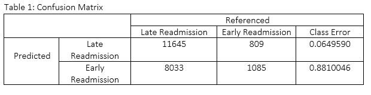

The ROC curve which shows the tradeoff between correctly predicted labels and that of the misclassified labels. We are mostly concerned about the area under the ROC curve. Below is the ROC of the model after prediction. The resulting area under the beneath ROC curve is given as 0.6129. However, it should be noted that the metrics used in quantifying AUC is between the ranges of 0.5 to 1.0. Therefore, it is not enough to say that our AUC of 0.6129 is a good value.
 
 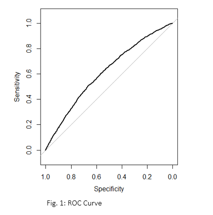

LOGISTIC REGRESSION MODEL
The core model fit from the best glm selection method is as presented in table 2 below. Since the optimum model having 7 parameters contain 6 variables, we dropped out race and gender from the core model i.e. the model without the A1C result. We carried out an analysis of deviance test and all 6 variables seem to be relevant to the model. 

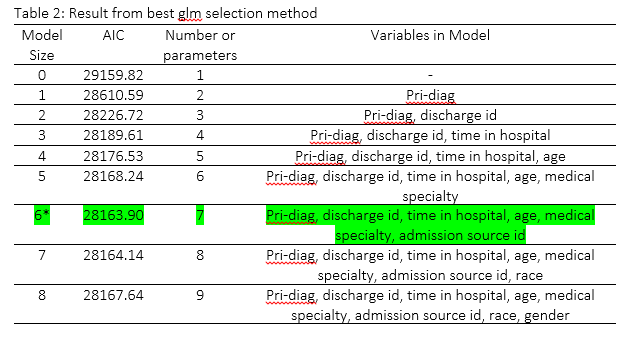

The resulting model from best glm selection technique was made to include HbA1c. Analysis of deviance test shows that HbA1c has a slightly large p-value of 0.074. The p-value of HbA1c is relatively large compared with other variables in the model with a small deviance value. This suggest that HbA1c, if removed from the model will not make much impact. However, the data set should tend to shrink p-value but a large p-value of HbA1c indicate that it is significant enough.

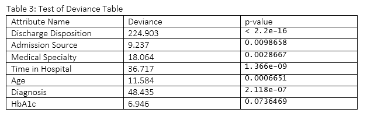

The covariates in the analysis were interacted in pairs to obtain significant interactions that will otherwise be useful in our analysis. Individual pairwise interactions was done for all 6_(C_2 )  possible interactions. The significant interactions were kept in the model and all significant interactions were fitted to check the deviations. HbA1c was also interacted with the covariate and the resulting final model is as presented in table 4 and 5 below.

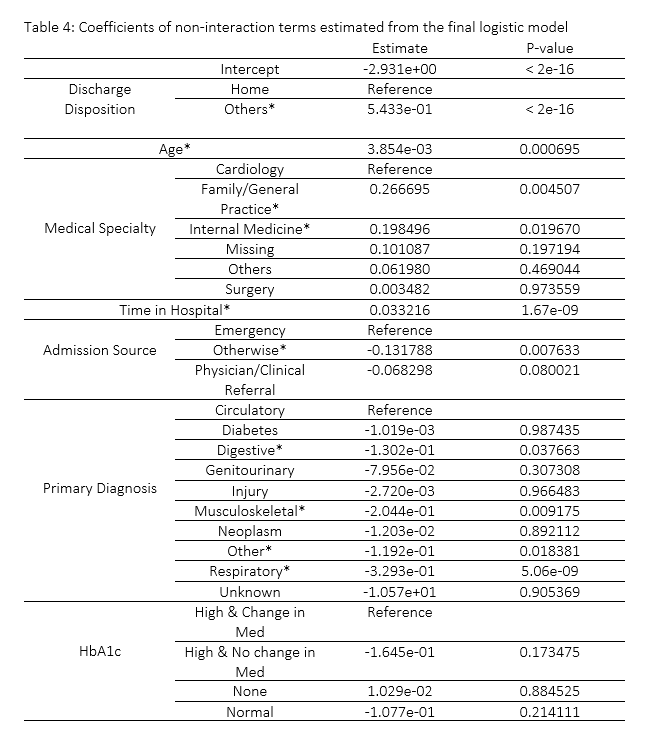

Interactions in the final model is as presented in table 5 below.

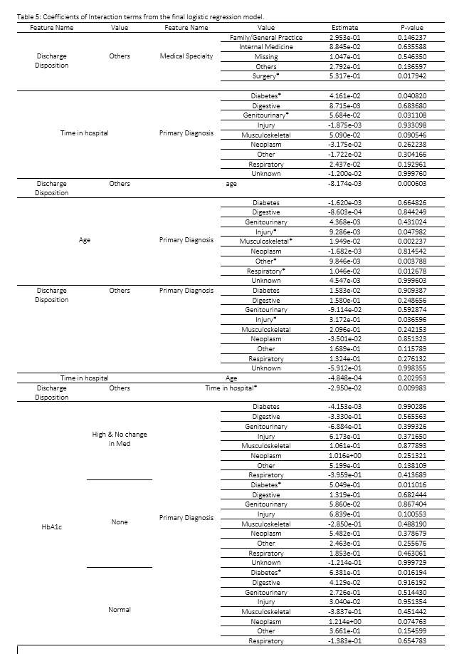

I have conducted a test of deviance to compare the core model and the final model. This is to check whether the interaction added is statistically significant in the model. The deviance test shows a very tiny p-value (4.426e-08) which suggest that we should include the interaction in our model.

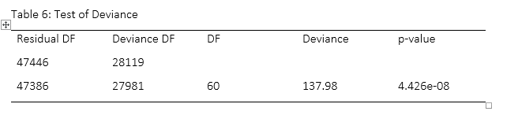

The area under the ROC curve of the final model was estimated to be 0.6076. Comparing this result with the final model in [1]. These two models are not too different from one another.
 
 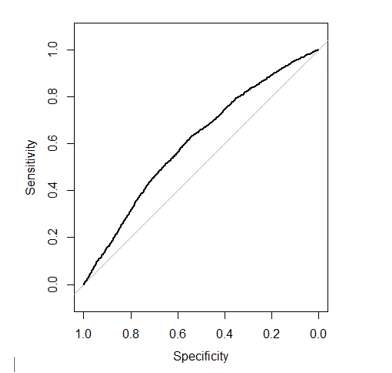
 
The confusion matrix is also shown to check the classification error rate of each classes.

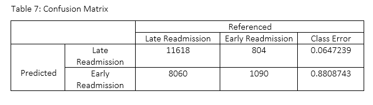

The result in the above table is very similar to the matrix of the final model generated in [1]. Classifying early readmission seem to come with a lot of prediction error.

RANDOM FOREST MODEL

Having fit a random forest model of readmitted with covariates (without HbA1c). The variable importance plot in suggest that gender and discharge disposition id are less important in our model. But the question remain – Is the gini index high enough for us to keep them in the           model? I think the gini index is close to 100 and if you would ask me, I would say we keep the two variables in the model.

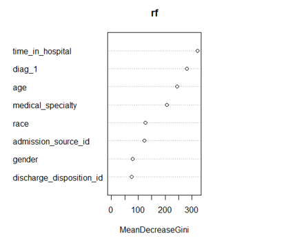

The error rate of the final model is as shown below to include the number of trees

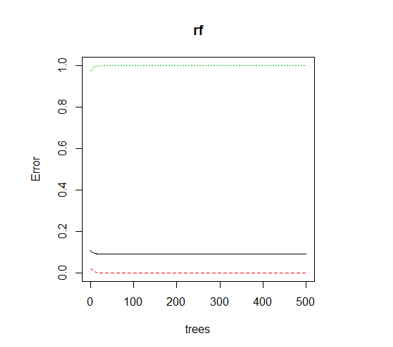
 
Looking at the trees plot above, the green curve indicates the error rate for early readmission and the red curve represent the error rate for late readmission. While the black curve represent the out of bag error rate. 
I saw the need to change the cut off (I made use of the mean probability of both prediction classes). Looking at the curve above, the error rate remains constant while the number of trees increases. We have reduced the number of trees to 200 in the next step and the resulting model is as shown below.
 
 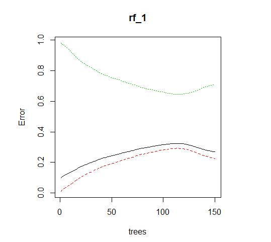

The error rate in the early readmission class has significantly dropped while there is an increase in the error rate of both late readmission and out of bad error rate.
In validating the above model, I have shown the confusion matrix and ROC curve below.

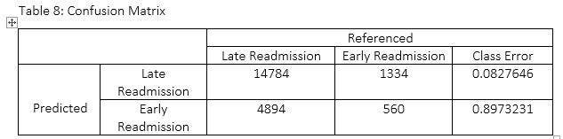

The have high sensitivity of 0.7513 and a low specificity of 0.2957. The accuracy of the model which shows how much right prediction is made in our model is 0.7113. This is quite reasonable because late readmission which happens to have a higher number of votes is well predicted.
The AUC of the ROC curve is given by 0.5238. This model when compared to the model without HbA1c is not too different.

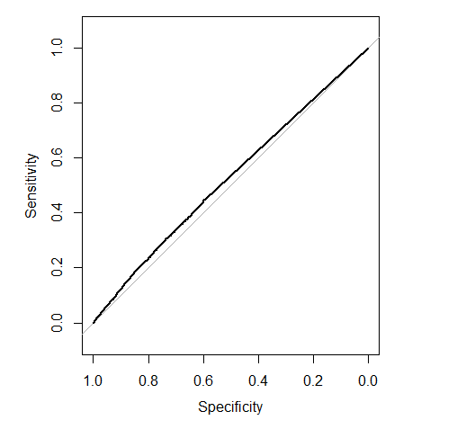
 
### Conclusion

From the two model built above, the Logistic regression model does a better job than the random forest model. Also, the significance of HbA1c from both model is not quite pronounced. Comparing the AUC values in the random forest model, the models look alike in al respect. 
Although the logistic regression suggest a slightly large p-value from the deviance test which suggest that HbA1c might not have a significant impact in the study of early readmission patients in the hospitals. 
